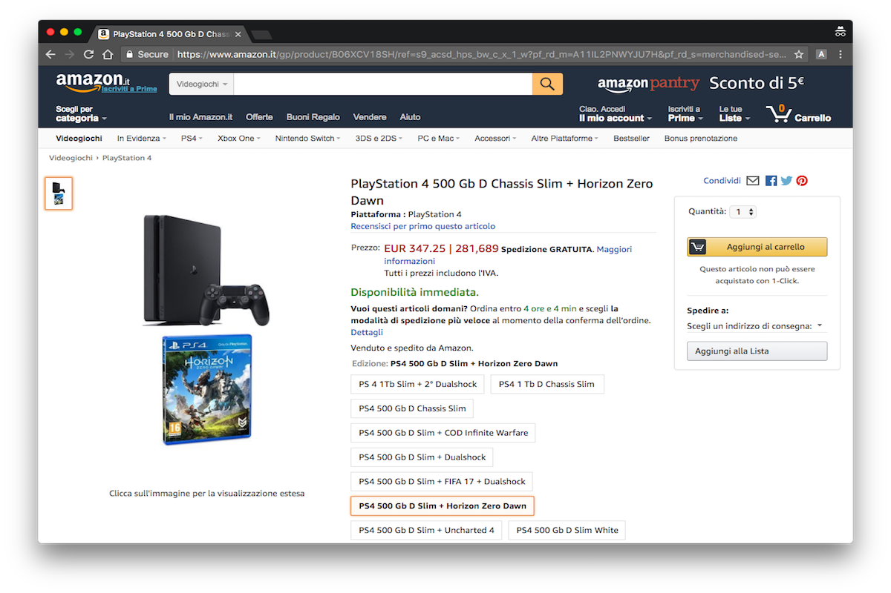
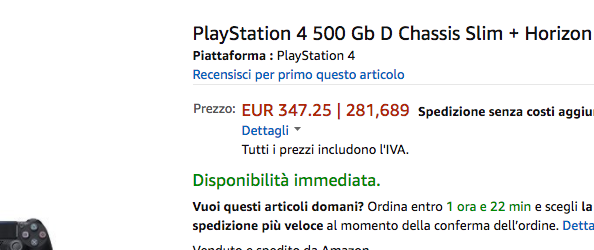

# AMAZON IVA4

> This extension has been developed for italian handicap users
that can discount their iva from 22 to 4%.

## Installation
Download `[soon download link]` from the Chrome Web Store or you can also install it manually by cloning **this repo** and load as [unpacked extension](http://lmgtfy.com/?iie=0&q=How+to+load+unpacked+extension+chrome).

## Usage

 

As you can see in the screenshot, after the page finish the loading, it automatically split ( with a `|` ) the price in 2 parts,
- The first is the *standard* price with full iva tax.
- The second one is the new price with 4% iva tax.

And this happens for **most of the products** in the page. (Not with shipments)

 

 

Made with :heart: by [Federico Vitale](https://rawnly.com)
